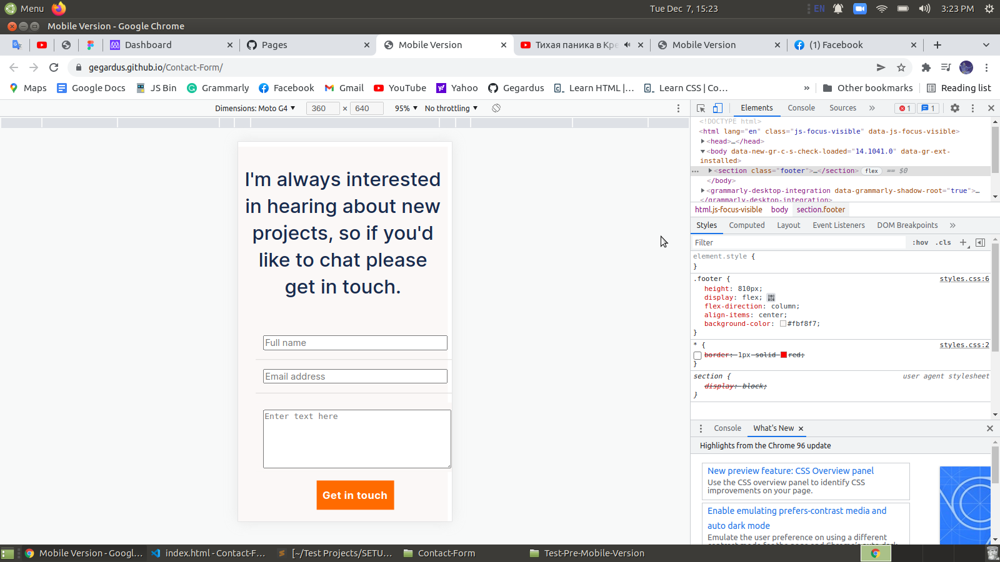

# Project Name

Setup-and-mobile-version-skeleton
Contact-form

> This is my first portfolio project in Microverse curriculum.

## Built With

- HTML
- CSS

## Live Demo

[Live Demo Link](https://gegardus.github.io/Contact-Form/)

## Getting Started

To get a local copy up and running follow these simple example steps.

### Prerequisites

VSCode
Github
Git

### Setup

Go to https://github.com/Gegardus/Contact-Form/tree/form

Click on code and copy the html code.

Use git bash to clone this repository on your local machine.

Run git checkout -b your-braanch-name Make your contributions

Push your branch up to your forked repository

Open a Pull Request with a detailed description to the development branch of the original project for a review

## Author

Vahan Khachvankian

- GitHub: https://github.com/Gegardus

## 📝 License

This project is [MIT](./MIT.md) licensed.
